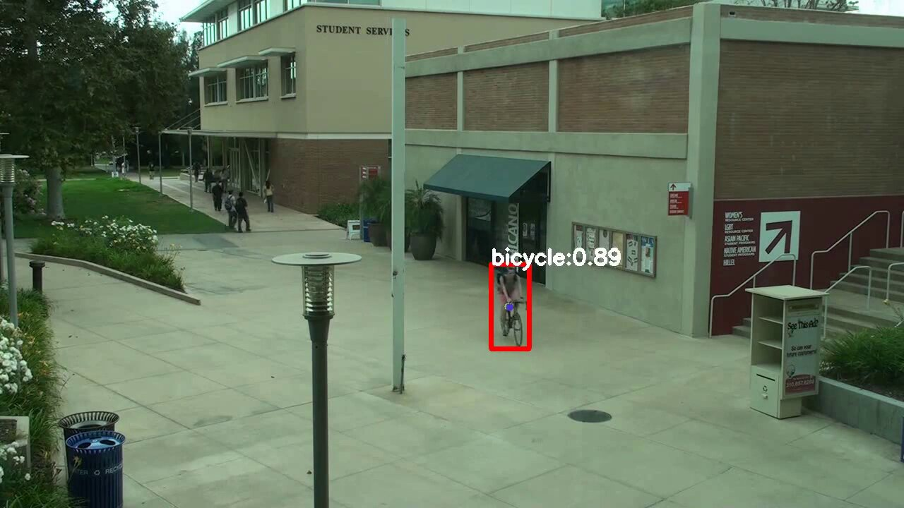
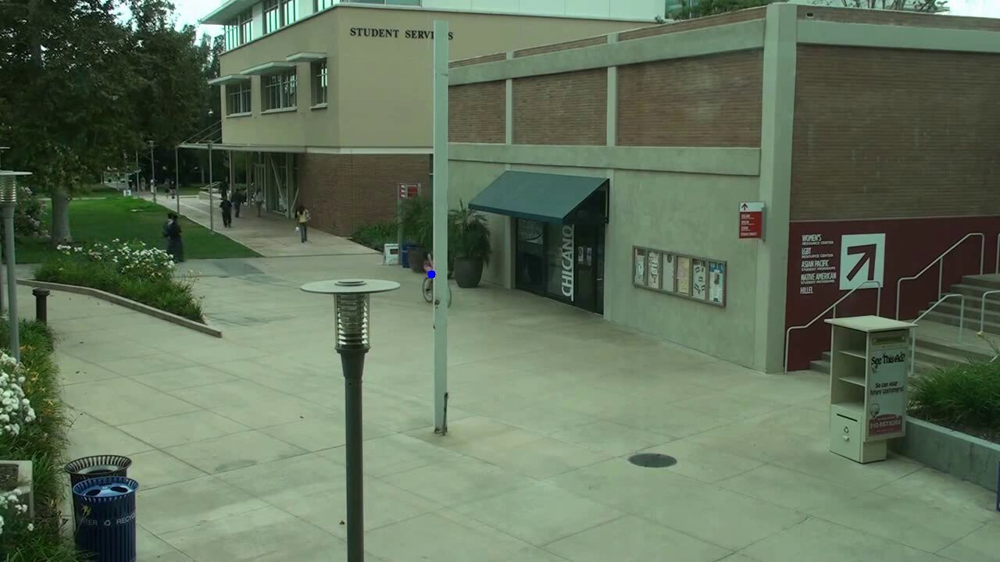

# Bicycle Tracking Using Kalman Filter

## Introduction

This project focuses on utilizing the Kalman filter to track a bicycle's movement in a surveillance video captured from a stationary camera. The video contains several challenges, including linear movement, abrupt turns, occlusion by objects (e.g., light posts), and occasional issues with object detection. We aim to enhance the tracking accuracy and robustness by implementing the Kalman filter.

## Project Overview

### Dataset
- : The project utilizes the Viraat dataset, a comprehensive collection of video footage from a surveillance camera.
- **About the dataset**
A Large-scale Benchmark Dataset for Event Recognition in Surveillance Video" by Sangmin Oh, Anthony Hoogs, Amitha Perera, Naresh Cuntoor, Chia-Chih Chen, Jong Taek Lee, Saurajit Mukherjee, J.K. Aggarwal, Hyungtae Lee, Larry Davis, Eran Swears, Xiaoyang Wang, Qiang Ji, Kishore Reddy, Mubarak Shah, Carl Vondrick, Hamed Pirsiavash, Deva Ramanan, Jenny Yuen, Antonio Torralba, Bi Song, Anesco Fong, Amit Roy-Chowdhury, and Mita Desai, in Proceedings of IEEE Comptuer Vision and Pattern Recognition (CVPR), 2011.
[Access Link](https://viratdata.org). 

### Object Detection
- **YOLOv4**: Object detection is performed using YOLOv4, a state-of-the-art real-time object detection system. YOLOv4 identifies the bicycle in the video frames, providing bounding box information.

### Challenges
- **Dynamic Scenarios**: The project addresses various challenges, including changes in object size (bounding box), temporary loss of object tracking, and object disappearance due to occlusion. These scenarios are common in real-world surveillance videos.

## Kalman Filter Implementation

The Kalman filter plays a pivotal role in improving object tracking in challenging scenarios. Here's how it works:

1. **Prediction**: When the object is not detected in a frame, the Kalman filter predicts the object's position based on its previous state and a motion model. This prediction helps maintain tracking continuity even when the object is temporarily hidden.

2. **Correction**: When the object is detected, the Kalman filter corrects the predicted position using the measurement information (e.g., bounding box coordinates). This ensures accurate tracking and reduces the impact of noise in object detection.

3. **Robustness**: The Kalman filter's ability to predict and correct enables it to handle occlusion, object disappearance, and changes in object size effectively. It significantly improves the robustness and reliability of the tracking system.

## Usage

To run the project and observe the Kalman filter in action, follow these steps:

1. **Clone the Repository**: Clone the project repository to your local machine.

2. **Run the Code**: Execute the provided code to apply the Kalman filter to the surveillance video. For ease experimenting the code is a Google colab file. Make a copy of it, save it in drive and you can experiment with it..

## Example Results

*Caption: Handling occlusion*

## Contributions

Contributions and feedback are highly encouraged and welcome! If you'd like to contribute to this project or report any issues, please open an [issue](https://github.com/yourusername/yourproject/issues) or submit a [pull request](https://github.com/Lucifer2700/Kalman_filters/pulls). Your input can help enhance the project's capabilities.

## License

This project is licensed under the MIT License - see the [LICENSE](LICENSE) file for details. Feel free to use, modify, and distribute the code in accordance with the license terms.

For more information and project updates, visit the project's GitHub repository: [Project Repository](https://github.com/Lucifer2700/Kalman_filters).

For inquiries and contact, reach out to [Harshal Bhat](mailto:hbhat@wpi.edu).

---

*Disclaimer: This project is an educational endeavor. It may not be suitable for deployment in critical applications without further refinement.*
